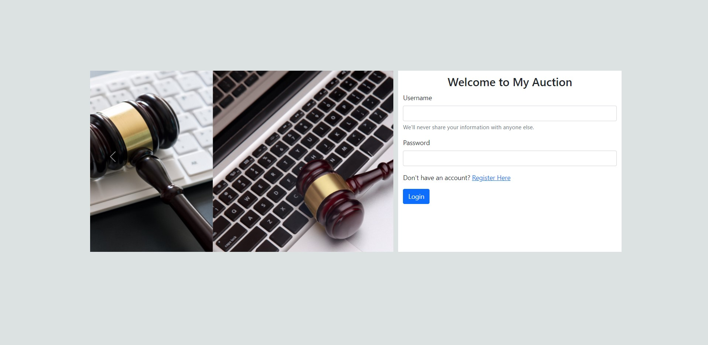
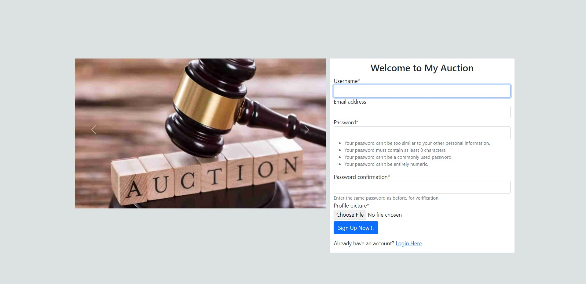
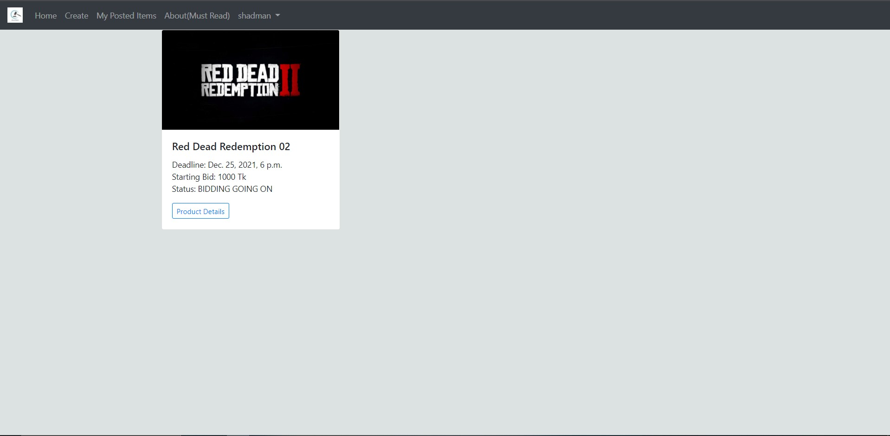
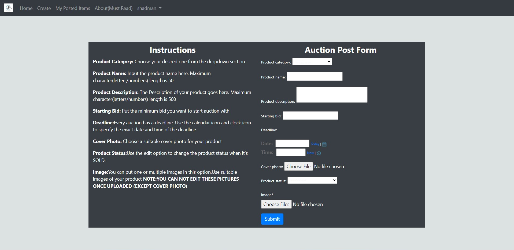
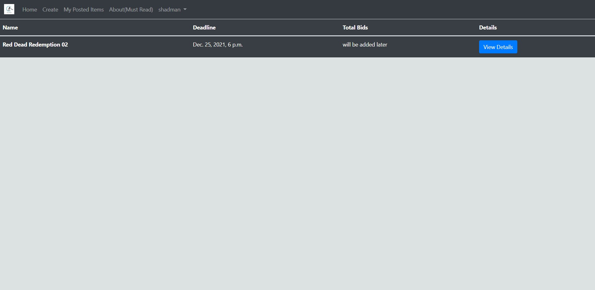
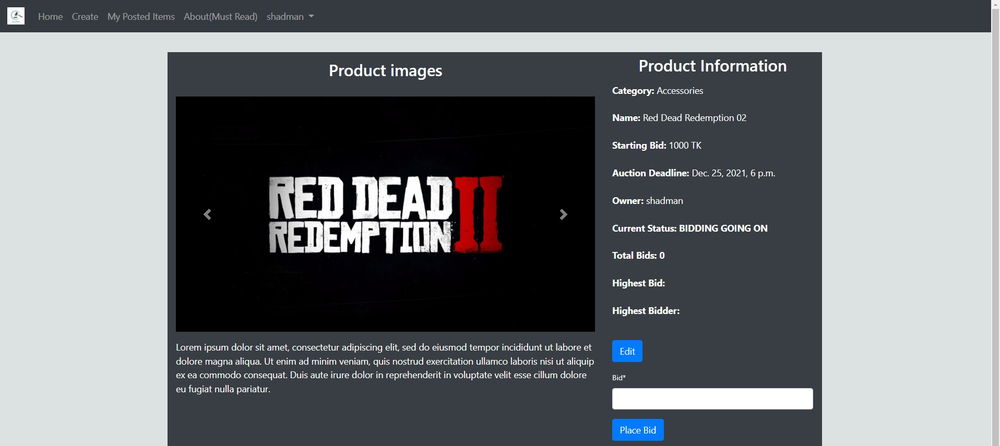
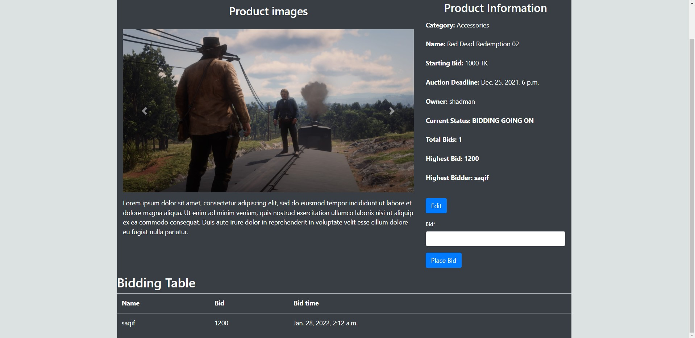
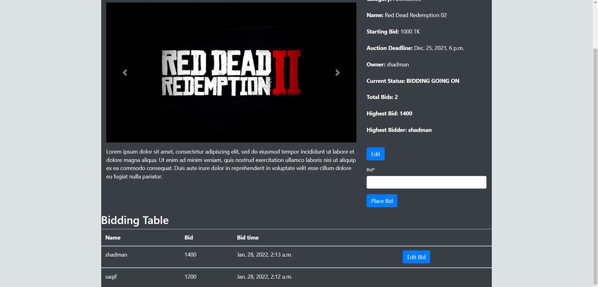

# Auction-Site
Welcome to [MyAuctionSite](https://shadman-auctionsite.herokuapp.com/) where a user can put an item on auction as well as participate in other auctions as well.

At 1st you will be redirected to login page. If you do not have an id, use 'register here' which will take you to another page where you need to put necessary information(including a photo) to create an id. After registering it will lead you to the login page where you must put id and password to proceed.

After login, you will see the auction gallery. For now it contains a dummy product which is up for auction. 

Use the "create" button on the navbar which will lead you to a page where contains a form. Fill the form by putting necessary information after reading the instructions beside. You can put only one cover photo. Use the bottom images field to put additional images of the product. After it is created, it will be shown in the homepage gallery.

A button in the navbar "my posted items" will take you to a page where it contains all the items you have put on auction.

By clicking view details of any product in the homepage, it will lead you to a page where you can see full details, images of the product and place bid. 

Your bid will be shown on the table on the same page. you can edit your bid by clicking the edit bid button beside your bid on the table. The highest bidder and bid will be constantly updated with each new bid. The highest bidder and bid will be highlighted in the product details section as well as will be on top of the table.

After the auction ends, the seller must change the product status to SOLD and mark the item as sold.

A dummy user is created so you can go and see the site. Username: shadman password: cse49915

Site Link: [My Auction Site](https://shadman-auctionsite.herokuapp.com/)

**ISSUES I FACED and Site issue that needs to be looked**

-In create functionality(step 3) I faced huge issues to provide the calendar and clock functionality to provide the auction deadline. It also took most time during my project timeline. The clock and calendar will help user put the deadline easily.*
-For somehow, I failed to render the profile page after a user edits their profile information. After editing, it will take the user to login page.
-After providing multiple images of a product, i failed to find a way to edit and change images of the product. So a user can only change cover photo but not the additional iamges.
-Although a user can see the highest bidder and bid but the product will only be marked sold when seller changes its status. I failed to handle the real time issue here.
